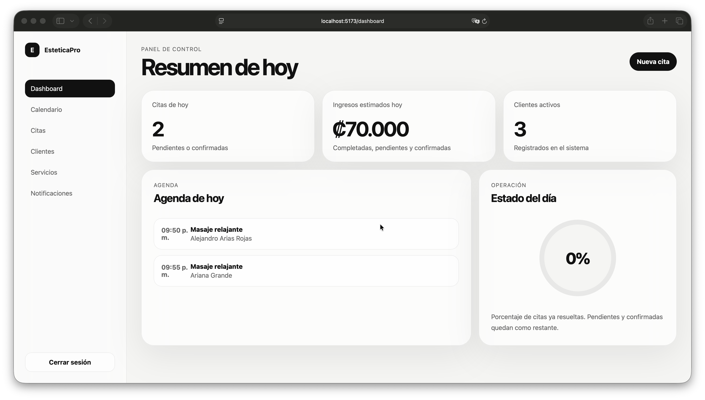
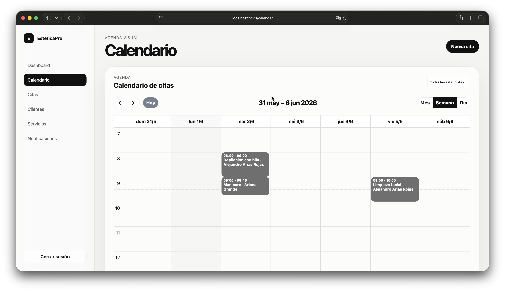
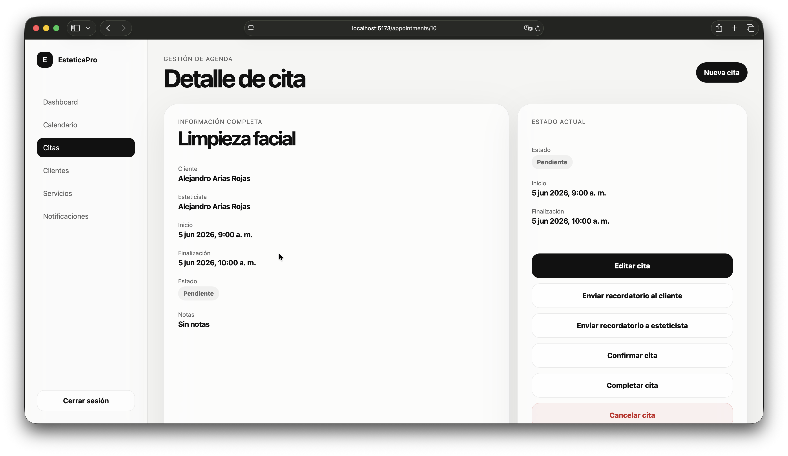
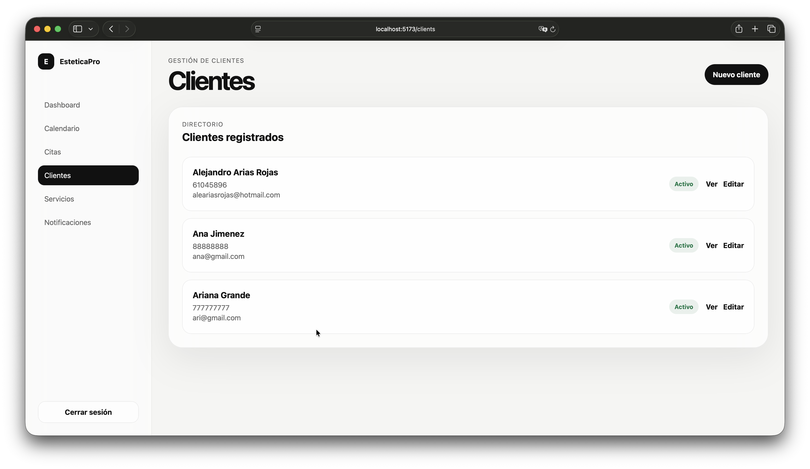
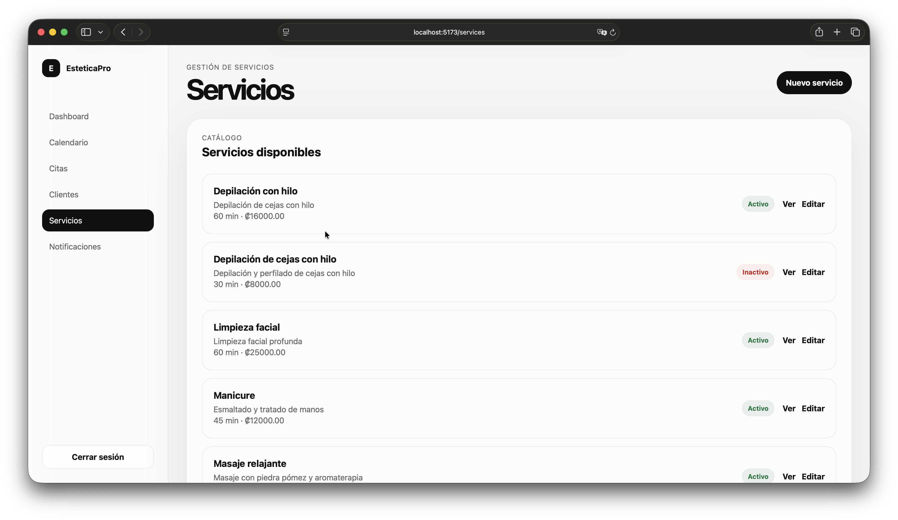
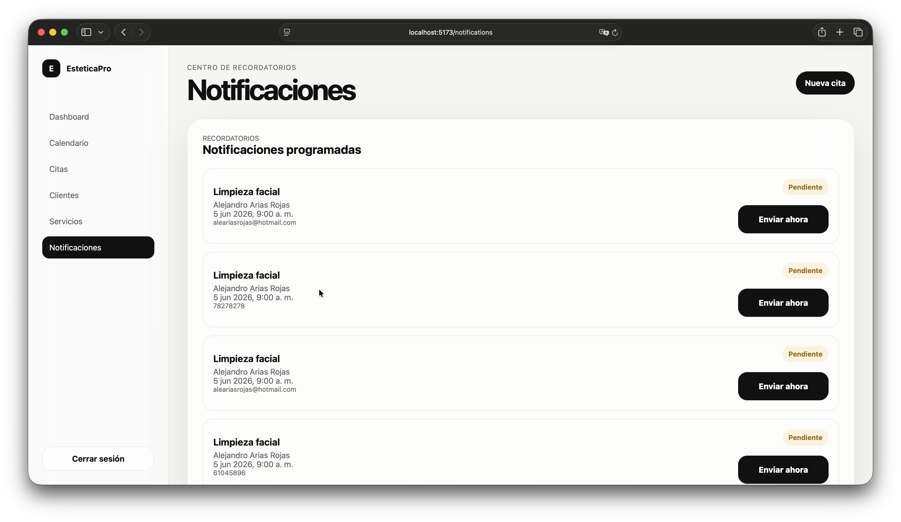

# EsteticaPro

Production-oriented appointment management platform for beauty salons and esthetic centers built with Django, Django REST Framework, React, TypeScript, Celery, Redis, MySQL, and JWT authentication.

---

# Overview

EsteticaPro is a scalable SaaS platform designed to manage appointments, clients, estheticians, services, notifications, and scheduling workflows for beauty salons and esthetic centers.

The system was designed following production-oriented architecture principles instead of a traditional academic CRUD-only approach.

Main goals of the platform:

- Centralized appointment management
- Automated reminders and notifications
- Role-based access control
- Secure JWT authentication
- Background task processing
- Scalable API-first architecture
- Multi-user workflow support
- Modern React-based user experience

The platform was built with extensibility and future commercialization in mind.

---

# Features

## Authentication & Security

- JWT Authentication (SimpleJWT)
- Role-based permissions
- Protected REST API endpoints
- Secure user management
- Custom user model
- Frontend route protection

## Appointment Management

- Create appointments
- Update appointments
- Cancel appointments
- Complete appointments
- Automatic appointment end-time calculation
- Appointment status management
- Daily scheduling workflow

## Services Management

- Dynamic esthetic services
- Duration management
- Pricing management
- Active/inactive service states

## Clients Management

- Client profiles
- Contact information
- Appointment history relationships
- Active/inactive client states

## Notifications System

- Automated appointment reminder generation
- Scheduled notification processing
- WhatsApp integration architecture
- Background processing with Celery
- Scheduled execution using Celery Beat
- Redis task broker integration
- Pending / Sent / Failed notification states

## Dashboard & Statistics

- Daily appointments dashboard
- Estimated daily revenue
- Appointment status analytics
- Role-filtered appointment visibility
- Operational business metrics

## Scheduling & Calendar

- Daily appointment calendar
- Esthetician filtering
- Available slots calculation
- Conflict prevention
- Automatic schedule validation

## Intelligent Scheduling

- Automatic availability calculation
- Appointment overlap prevention
- Service-duration-aware scheduling
- Dynamic available time slots

## Frontend Application

- React + TypeScript
- Responsive dashboard layout
- JWT authentication flow
- Protected routes
- Appointment management interface
- Service management interface
- Client management interface
- Dashboard statistics visualization
- Role-based navigation

---
# Business Rules

- Inactive clients cannot receive appointments
- Inactive services cannot be scheduled
- Only users with ESTHETICIAN role can be assigned to appointments
- Appointment end times are calculated automatically
- Appointment conflicts are prevented
- Past appointments cannot be created as active appointments
- Appointment visibility is filtered by user role
---

# Tech Stack

## Backend

- Python
- Django
- Django REST Framework
- MySQL
- Celery
- Redis

## Frontend

- React
- TypeScript
- Vite
- React Router
- Axios
- Context API
- CSS

## Authentication

- JWT (SimpleJWT)

## Infrastructure

- Celery Worker
- Celery Beat Scheduler
- Redis Broker

## Integrations

- Sent.dm (WhatsApp API)
- REST API Architecture

## Development Tools

- Postman
- VS Code
- Git
- Virtual Environments

---

# Architecture

The project follows a modular architecture using Django applications separated by business domains.

estetica/
├── backend/
│   ├── apps/
│   │   ├── accounts/
│   │   ├── appointments/
│   │   ├── clients/
│   │   ├── dashboard/
│   │   ├── notifications/
│   │   └── services/
│   │
│   ├── config/
│   ├── manage.py
│   └── requirements.txt
│
├── frontend/
│   ├── src/
│   ├── public/
│   └── package.json
│
└── README.md

---

# Main Architectural Decisions

## API-First Design

The backend was designed as a REST API platform intended to support:

- React frontend
- Mobile applications
- External integrations
- Third-party systems

## Background Task Processing

Time-sensitive and asynchronous operations are handled using Celery and Redis:

- Appointment reminders
- Notification scheduling
- WhatsApp messaging
- Future reporting tasks
- Future email delivery

## Role-Based Access Control

The platform supports different operational roles:

| Role | Permissions |
|--------|--------|
| ADMIN | Full system access |
| RECEPCIONISTA | Client and appointment management |
| ESTETICISTA | Access only to assigned appointments |

## Automated Scheduling Logic

The system automatically:

- Calculates appointment end times
- Generates reminder notifications
- Schedules future notifications
- Filters appointment visibility by role

---

# Notifications Workflow

Appointment Created
        ↓
Automatic Notification Generation
        ↓
Notifications Stored in Database
        ↓
Celery Beat Scheduler
        ↓
Celery Worker Execution
        ↓
WhatsApp Provider - Email Delivery

Current implementation supports:

- Scheduled notifications
- Celery background processing
- Redis task queue
- Pending / Sent / Failed notification states
- WhatsApp integration through Sent.dm

Current provider status:

- Sent.dm integration completed
- Account onboarding verification pending for production message delivery

---

# API Endpoints

## Authentication

text /api/token/ /api/token/refresh/ 

## Services

text /api/services/ 

## Clients

text / api/clients/ 

## Appointments

text /api/appointments/ 

## Dashboard

text /api/dashboard/today/ /api/dashboard/stats/ 

---

## Backend Setup

### Create Virtual Environment

bash python -m venv venv 

### Activate Environment

macOS/Linux

bash source venv/bin/activate 

Windows

bash venv\Scripts\activate 

### Install Dependencies

bash pip install -r requirements.txt 

---

## Frontend Setup

bash cd frontend npm install 

---

# Environment Variables

Create a .env file inside the backend directory:

DB_NAME=estetica
DB_USER=root
DB_PASSWORD=your_password
DB_HOST=127.0.0.1
DB_PORT=8889

SENT_DM_API_KEY=your_api_key
SENT_DM_TEMPLATE_ID=your_template_id

---

# Database Setup

## Run Migrations

bash python manage.py migrate 

## Create Superuser

bash python manage.py createsuperuser 

---

# Running the Project

## Start Django Server

bash python manage.py runserver 

## Start Redis

bash redis-server 

or

bash brew services start redis 

## Start Celery Worker

bash celery -A config worker -l info 

## Start Celery Beat

bash celery -A config beat -l info 

## Start React Frontend

bash npm run dev 

---

# Project Status

Current Development Status:

### Backend

- Completed core architecture
- REST API operational
- JWT authentication operational
- Celery operational
- Redis operational
- MySQL operational
- WhatsApp integration operational

### Frontend

- React application operational
- Authentication flow operational
- Dashboard operational
- Appointment management operational
- API integration operational

### Infrastructure

- Celery configured
- Redis configured
- JWT configured
- Sent.dm integration configured

---
# Screenshots

## Dashboard

## Calendar

## Appointments

## Clients

## Services

## Notifications

---

# Author

Alejandro Arias Rojas

Software Developer  
Business Informatics Engineering  
Universidad de Costa Rica
